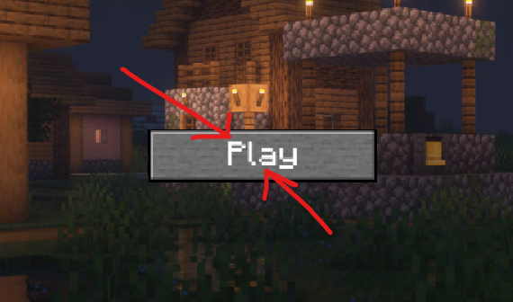
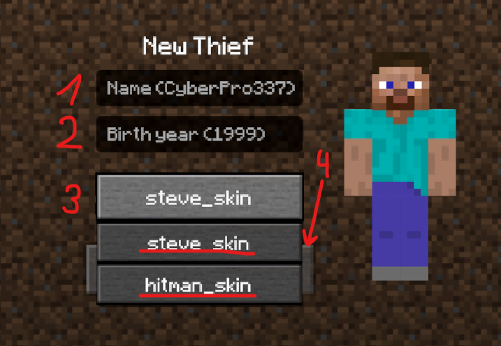
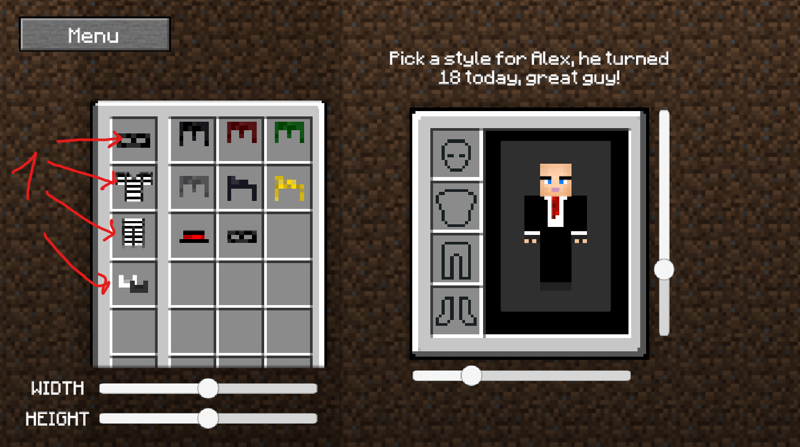
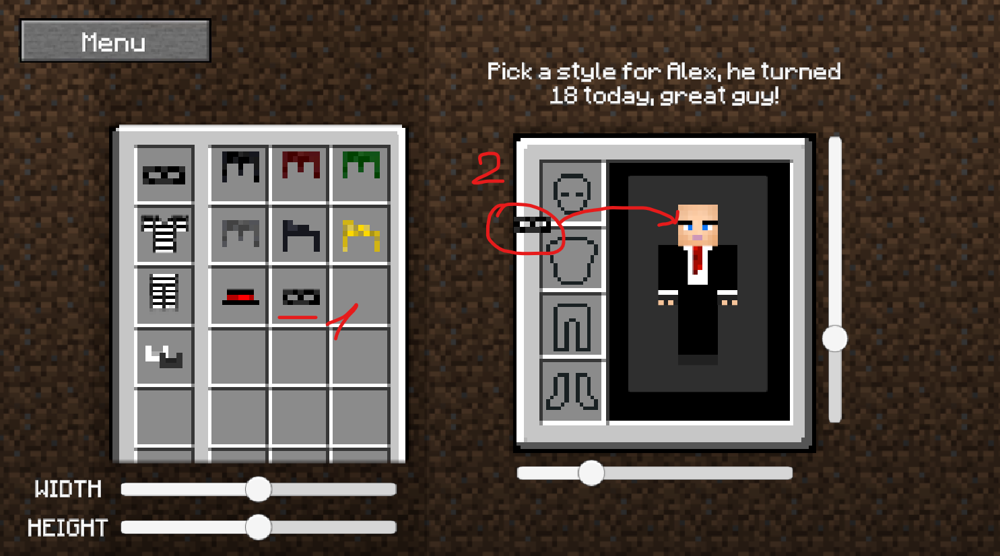
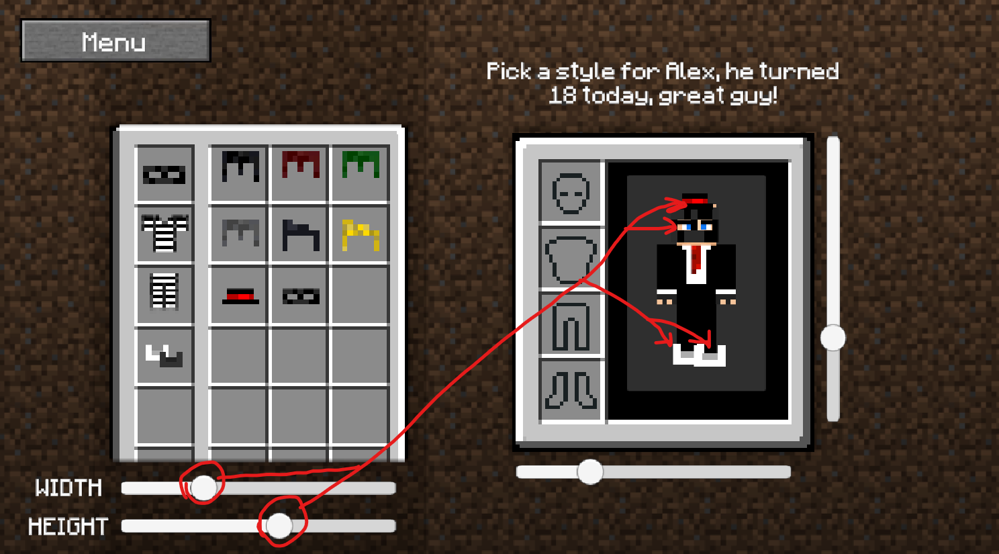
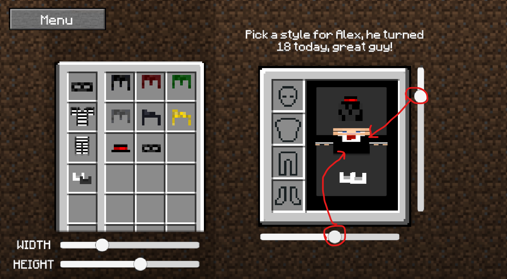
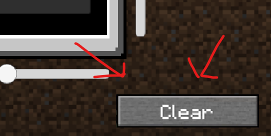

> [!WARNING]
>  Due to problems with the transfer of game packages there were some problems on the main branch, for this reason now works not the main branch and the master branch!!!
# Come up with a style for your character!

## Goals
- [x] Drag and drop
- [x] Registration
- [x] Obj resizing

---

# Little guide

### Start
1. Press start button

### Character selection

Fill in the input fields, for example:
1. name `Alex`
2. password `2006`
3. Select a character skin for customization
4. Click the create button

### Character customize

---

1. You can choose the type of clothing

---

1. Select the clothes you want to put on your character
2. Put clothes on the character

---

1. By selecting clothes from the list you can change its size
2. Change the size with the sliders

---

1. Change the size with the sliders

---

1. Clear button, removes all taken items from the inventory

---

## Authors

- [AlexOsta](https://github.com/AlexUnderOS)

